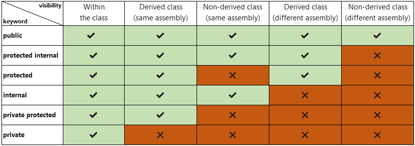

[Volver](Apuntes%20WinUI.md)

Se asumen conocimientos básicos en Java:
- [Abstracción, Encapsulamiento, Herencia, Polimorfismo](https://www.youtube.com/watch?v=SI7O81GMG2A)
- [Ligadura dinámica](https://www.youtube.com/watch?v=H0Q7P_limN8)
- Polimorfismo vs Sobrecarga
``` csharp
// SOBRECARGA: Diferentes formas de retornar un valor en una clase
class Calculadora
{
    public int Sumar(int a, int b) => a + b;
    public double Sumar(double a, double b) => a + b;
}

// POLIMORFISMO: Sobreescritura de métodos
class Animal
{
    public virtual void Hablar() => Console.WriteLine("Animal habla");
}
class Perro : Animal
{
    public override void Hablar() => Console.WriteLine("Guau");
}
Animal a = new Perro();
a.Hablar(); // "Guau"
```

<hr/>

[Vídeo fuente](https://www.youtube.com/watch?v=j8sxDnr7nPY) usado para estos apuntes
## Base de una clase

``` csharp
class Sale {
	public decimal Total { get; set; }
	// Getter y setters al declarar la variable
	public decimal Total2 { get; }
	// ✅ Válido
	public decimal Total3 { get; private set; }
	// ✅ Válido, acceso privado
	public decimal Error { set; }
	// ❌ No puedes tener solo un setter, dará error de ejecución
	
	
	public Sale()
	{
	}

	public Sale(decimal total)
	{
		this.Total = total // ✅ Válido
		Total = total // ❗ Válido siemrpe que no se nombren igual (total, total)
	}

	// Métodos
	public string GetInfo()
	{
		return "El total es " + Total;
	}
}

Sale sale = new Sale();
var sale = new Sale();
// Este var ahorra escribir la clase, pero sigue teniendo tipado fuerte, no se puede cambiar su valor
Sale sale = new();

Console.WriteLine(sale.GetInfo());
```

## Herencia

``` csharp
class Sale {
	public decimal Total { get; set;}

	public Sale(decimal total)
	{
		Total = total
	}

	// Métodos
	public virtual string GetInfo() 
	// Virtual permite sobreescritura, en caso contrario se llamará al padre
	{
		return "El total es " + Total;
	}
}

class SaleWithTax : Sale
{
	public decimal Tax { get; set; }
	public SaleWithTax(decimal total, decimal tax) : base(total) 
	// Obligatorio, similar al super() de Java
	{
		Tax = tax;
		
		GetInfo() 
		// Si el método fuera privado, no podría acceder. 
		// Con protected la propia clase y los hijos pueden
		
	}
	
	public override string GetInfo()
	{
		return "El total es " + Total + "Impuesto: " + Tax;
	}

	// SOBRECARGA - OVERLOADING
	public string GetInfo(string message)
	{
		return message;
	}
}
```
## Convención de escritura

Se puede usar **camelCase** para el código, pero es más común usar **PascalCase**, donde todo es mayúsculas y las interfaces llevan una I al inicio:

``` csharp
class Persona { }
private decimal _amount;
public static decimal MIN_AMOUNT = 0.2m;
void CalcularTotal() { }
public string Nombre { get; set; }
interface IRepositorio { }
enum EstadoPedido { Pendiente, Enviado, Entregado }
```

## Modificadores de clase

> **NOTA:** Un assembly es un archivo compilado que contiene código ejecutable



``` csharp
class Padre { // internal por defecto
    class Hijo { }  // private por defecto
}
```

### Modificadores especiales

- **sealed:** Impide que una clase pueda ser heredada

``` csharp
public sealed class Banco
{
    public void Operar() => Console.WriteLine("Operación bancaria");
}

public class BancoInternacional : Banco { } // ❌ Error de compilación
```

- **partial:** Permite dividir la definición de una clase en varios archivos del mismo proyecto. Usado para separar código generado automáticamente del manual entre otros motivos

``` csharp
// Persona.Parte1.cs
public partial class Persona
{
    public string Nombre { get; set; }
}

// Persona.Parte2.cs
public partial class Persona
{
    public int Edad { get; set; }
}
```
## Nullable

En C#, no puedes asignar directamente `null` a tipos de dato básicos, exceptuando:
- String
- Object
- Class
- Array[]
- Delegate
- . . .

Para ello deberás usar `Nullable<>`

``` csharp
int numero = null; // ERROR
int? numero = null; // Forma #1
Nullable<int> numero = null; // // Forma #2


public class Persona
{
    public int? Edad { get; }

    public Persona(int? edad)
    {
        Edad = edad;
    }
}
```

#### dato? -> dato

En métodos donde se pida un tipo de dato específico, no se permite la ejecución si introduces ese dato nullable, por lo que necesitas "parsearlo". Esta es una forma:

``` csharp
long? maybeId = null;
long id = maybeId ?? 0; // si es null -> usa 0
```

#### Nullable & Null-Forgiving

El compilador siempre dará Warnings sobre posibles valores `null` en el código. El operador `?` lo usaremos para indicar que es `Nullable`, es decir, que en vez de arrojar un NullException, se considere un null y siga el programa. Si en nuestro código sabemos que nunca va a ser null, y tenemos el warning, podemos usar `!` para indicar al compilador que no va a ser null (No evita arrojar NullException si acaba siendo un null)

``` csharp
// Tipo Nullabe
List<int>? numeros = null;

if (numeros?.Any() == true) // Si numeros es null -> false
{
    Console.WriteLine("Hay elementos");
}
else
{
    Console.WriteLine("Lista vacía o null");
}

// Null-Forgiving
string? nombre = "Hola";
int longitud = nombre.Length; // Warning, nombre puede ser null
int longitudSeguro = nombre!.Length; // Nada
```
### Notas sobre tipos de datos

- **SUFIJOS**
 Para declarar un número es necesario usar un sufijo. Puede estar en mayúsculas o minúsculas:
``` csharp
// 8 bits
byte edad = 25;              // 0 a 255
sbyte temperatura = -12;     // -128 a 127

// 16 bits
short altura = 170;          // -32,768 a 32,767
ushort capacidad = 65000;    // 0 a 65,535

// 32 bits
int cantidad = 123456;       // -2,147,483,648 a 2,147,483,647
uint stock = 150u;           // sufijo u (unsigned)

// 64 bits
long poblacion = 7800000000L;    // sufijo L para long
ulong maximo = 18446744073709551615UL; // sufijo UL (unsigned long)

// Punto flotante
float pi = 3.1416f;          // sufijo f
double peso = 75.5;          // double es por defecto
double gravedad = 9.81d;     // sufijo d (opcional)

// Alta precisión decimal (128 bits)
decimal precio = 199.99m;    // sufijo m para decimal
decimal interes = 0.025M;    // sufijo M (mayúscula también válida)

```
 
 - **Sobre Integer**
Como ya vimos los datos usan Nullables para ello, por lo que se usan enteros:

	- `byte` (8 bits, sin signo)
	- `sbyte` (8 bits, con signo)
	- `short` (16 bits, con signo)
	- `ushort` (16 bits, sin signo)
	- `int` (32 bits, con signo) // System.Int32 (Tipo real de int, se traduce)
	- `uint` (32 bits, sin signo)
	- `long` (64 bits, con signo)
	- `ulong` (64 bits, sin signo)
	- `float` (32 bits, punto flotante)
	- `double` (64 bits, punto flotante)
	- `decimal` (128 bits, alta precisión para financieros)

- **string - String**:
Apuntan al mismo tipo, pero string se usa principalemente para declarar variables y String para usar sus métodos

``` csharp
string nombre = "Juan";
string saludo = String.Concat("Hola", " ", "mundo");

string a = "hola";
String b = "hola";
Console.WriteLine(a.GetType() == b.GetType());  // True
```

- **bool - Boolean**
Apuntan al mismo tipo, **se debe usar mayormente `bool`** ya que `Boolean` es el nombre del tipo en .NET (`System.Boolean`) y se usa en programación más avanzada.

``` csharp
bool a = true;
Boolean b = false;

Console.WriteLine(a.GetType()); // Imprime: System.Boolean
Console.WriteLine(b.GetType()); // También: System.Boolean
```
## Interfaces

``` csharp
interface ISale
{
	decimal Total { get; set; }
}
interface ISave
{
	public void Save();
}

public class Sale : ISale, ISave // No hay límite siempre que se cumplan las reglas
{
	public decimal Total { get; set; }
	
	public void Save()
	{
		Console.WriteLine("Saved in BD!")
	}
}
public class Beer : ISave
{
	public void Save()
	{
		Console.WriteLine("Saved in Service!")
	}
}

// PRUEBAS
void Some(ISave save)
{
	save.Save();
}
var sale = new Sale();
var beer = new Beer();

Some(sale);
Some(beer);

```

## Generics

``` csharp
public class MyList<T>
{
	private List<T> _list;
	private int _limit;
	
	public MyList(int limit) {
		_limit = limit;
		_list = new List<T>();
	}

	public void Add(T element)
	{
		if(_list.Count < limit)
		{
			_list.Add(element)
		}
	}
	
	public string GetContent()
	{
		string content = "";     
		// ❗ Los string son inmutables, se recomienda usar StringBuilder
		
		foreach(var element in _list) {
			content += element + ", ";
		}
	}
}

var numbers = new MyList<int>(5) // Pasa a ser una lista de int de 5 elementos
var names = new MyList<string>(5) // Pasa a ser una lista de string de 5 elementos
```

Se puede aplicar a colecciones de datos inventados

``` csharp
public class Beer
{
	public string Name { get; set; }
	public decimal Price { get; set; }
}
var beers = new MyList<Beer>(3) // Lista de un objeto inventado
beers.Add(new Beer()
{
	Name = "Erdinger",
	Price = 5
});
beers.Add(new Beer()
{
	Name = "Corona",
	Price = 2
});
beers.GetContent();     // Retornará una lista [Beer, Beer]

public class Beer 
{
	public string Name { get; set; }
	public decimal Price { get; set; }

	// Por defecto se usa ToString() al imprimir una clase que hereda de objeto (Por defecto). Para evitarlo hay que redefinir un objeto en la clase
	public override string ToString()
	{
		return Name.ToString();
	}
}
beers.GetContent();     // Retornará una lista [Erdinger, Corona]

```

## Serialización y deserialización - JSON

Útil para serializar objetos para realizar peticiones a servicios

``` csharp
using System.Text.Json;

public class People
{
	public string Name { get; set; }
	public int Age { get; set; }

	// Método estático de la clase People, ahorrando sintáctica del return
	public static string Get() => "Hola";
}

// Serializar
var hector = new People()
{
	Name = "Héctor",
	Age = 36
};
	// Propiedad estática de la clase importada
string json = JsonSerializer.Serialize(hector)

// Deserializar
	// Es necesario indicarlo con @ para hacer strings en diferentes filas
	// Se usa doble comilla para indicar que es una comilla en string
string myJson = @"{
	""Name"":""Héctor"",
	""Age"":36
}";
People hector = JsonSerializer.Deserialize<People>(myJson);
	// Dara un warning diciendo que myJson puede ser null porque es un string
	// Solución:
	People? hector = ...

```

## Var & using

`var` - sirve para la inferencia de tipos. El compilador deduce el tipo de la variable según el valor que se le asigne.  `using` se usa para asegurar que un objeto que implementa `IDisposable` se libere automáticamente al salir del bloque de código. Se pueden usar juntos

``` csharp
using (var file = new StreamWriter("archivo.txt"))
{
    file.WriteLine("Hola mundo");
} // <- aquí se llama automáticamente a file.Dispose()

```
## Programación funcional

- **Action**
Ejecuta una acción (función) de N parámetros que no retorna nada

``` csharp
void Some(Action<string> fn, string message)
{
	Console.WriteLine("Inicio");
	fn(message);
	Console. WriteLine("Final");
}
// Action<T1, T2, T3, ...>
// Ejecuta una función con N parámetros

void Show(string message)
{
	Console. WriteLine(message);
}
var show = Show;
Some(show, "test")
```

- **Func**
Ejecuta una acción (función) de N parámetros que puede retornar un dato

``` csharp
void Some(Func<string, string> fn, string message)
{
	Console.WriteLine("Inicio");
	Console. WriteLine(fn(message));
	Console. WriteLine("Final");
}
// Func<T1, T2, T3, ..., Tresult>
// Ejecuta una función con N parámetros, el último es el tipo devuelto

string Show(string message)
{
	return message.ToUpper();
}
var show = Show;
Some(show, "test")
```

## Expresiones Lambda

``` csharp
// Dos formas de hacer lo mismo, la 1º con lambda

Func<int, int, int> sub = (a, b) => a - b
	// C# entiende que son int "a" y "b"
	
int sub2(int a, int b)
{
	return a - b
}

// Si solo es un parámetro, no necesitamos paréntesis
Func<int, int> some = a => a * 2;

// Si necesitas más de una línea
Func<int, int> some = a =>
{
	a = a + 1;
	return a * 5;
}

```
