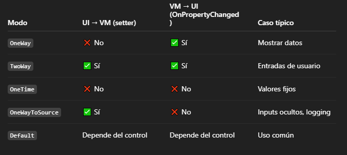

[Volver](Apuntes%20WinUI.md)

## Paginación

https://www.youtube.com/watch?v=YaJDJWpm9UA
https://www.youtube.com/watch?v=KHkMd9hxiI4

Siguiendo una paginación con NavigationView para moverse por 3 páginas principales (1 por defecto cuando no se seleccione ninguna), y dentro de estas moverse por subpáginas.

## Patrón MVVM

## Conectar View-ViewModel

Se puede hacer de dos formas, desde el XAML y desde el Code-Behind. Se recomienda la segunda opción.

``` xml
<Window x:Class="BuildAssistantUI.BuildAssistantWindow"
        xmlns="http://schemas.microsoft.com/winfx/2006/xaml/presentation"
        xmlns:x="http://schemas.microsoft.com/winfx/2006/xaml"
        xmlns:VM="clr-namespace:BuildAssistantUI.ViewModels">
	<!-- Conectar -->
    <Window.DataContext>
        <VM:MainViewModel/>
    </Window.DataContext>
</Window>
```

``` csharp
public sealed partial class HomePage : Page
{
    public HomePage()
    {
        this.InitializeComponent();
        // Conectar V-VM
        this.DataContext = new HomePageViewModel();
    }
}

```
## RelayCommand

Debe usarse para evitar acomplamiento entre el View y el ViewModel. Por ejemplo al hacer clicks, no es buena práctica enlazar con `<Click="Método>`, no deben conocerse entre ellos. Además, hace que las pruebas unitarias sean más sencillas, ya que no tienen que pulsar el botón en si.

Se puede implementar de forma manual:
https://www.youtube.com/watch?v=4v8PobcZpqM

#### Clase RelayCommand implementada

``` csharp
public class RelayCommand : ICommand
{
    public event EventHandler? CanExecuteChanged;
    private Action<object> _Execute {  get; set; } // Ejecuta y retorna void
    private Predicate<object> _CanExecute {  get; set; } // Ejecuta y devuelve bool

    public RelayCommand(Action<object> ExecuteMethod, Predicate<object> CanExecuteMethod)
    {
        _Execute = ExecuteMethod;
        _CanExecute = CanExecuteMethod;
    }

    public bool CanExecute(object? parameter)
    {
        return _CanExecute(parameter);
    }

    public void Execute(object? parameter)
    {
        _Execute(parameter);
    }
}
```

En cambio, es más recomendable usar el paquete de NuGet `Community.Toolkit.Mvvm`, ya que cuenta con RelayCommand implementado. Su uso está explicado en la [documentación oficial](https://learn.microsoft.com/es-es/dotnet/communitytoolkit/mvvm/relaycommand)

> En los ViewModel, se implementa `INotifyPropertyChanged` para actualizar automáticamente la View correspondiente ante cualquier cambio. y poder conectar el Binding correctamente. Se usa `ObservableObject` porque ya implementa esta interfaz.


## OutPut y WriteLine

En **WinUI**, no hay una versión especial de `Console.WriteLine` para la UI, porque las aplicaciones WinUI no son aplicaciones de consola. En cambio, para hacer algo similar, al depurar, en Output, puedes imprimir mensajes.

``` csharp
Console.WriteLine("Hello World!");
// No escribirá nada

System.Diagnostics.Debug.WriteLine("Mensaje de depuración");
// Aparecerá en Output
```

## Http

Documentación recomendada para empezar:
https://learn.microsoft.com/es-es/dotnet/fundamentals/networking/http/httpclient

En este caso, crearemos una clase estática para realizar las peticiones más fácilmente. Dentro de la clase, sacado de la documentación, inicializaremos el cliente y añadiremos un Header para que el backend responda en español. De querer hacer, se puede hacer dinámico y mandar en varios idiomas.

``` csharp
private static readonly HttpClient _httpClient = new HttpClient()
{
    BaseAddress = new Uri("http://localhost:8080/")
};

// Constructor estático
static ArchiHttpRequest()
{
    _httpClient.DefaultRequestHeaders.AcceptLanguage.ParseAdd("es");
}
```

#### Definir y llamar a método

Debemos usar la palabra `async` en todas estas operaciones para evitar errores de ejecución (Al no esperar la respuesta devolverá siempre null)

``` csharp
public async Task<TASKCLASS> MetodoEjemplo(Client client)
{
	...
}

// Llamar
TASKCLASS respuesta = await MetodoEjemplo(client);
// Convertir a Json la respuesta
CLASS json = JsonSerializer.Serialize(respuesta);
```

#### Cuerpo de petición

- JSON
Se usa StringContent para poder construir un json con características customizadas

``` csharp
	using StringContent jsonContent = new(
	    JsonSerializer.Serialize(clientDto), // Objeto que se convierte a json
		Encoding.UTF8, // Definir letra del json
		"application/json" // Define el tipo de archivo
    );
```

- RequestParams
Para realizar peticiones estilo `url/clients/find?param1=Def&param2=Def...`

``` csharp
// Inicializa una Query vacía
NameValueCollection query = HttpUtility.ParseQueryString(string.Empty)
// Añadimos parámetros
if (!string.IsNullOrEmpty(name))
    query.Add("name", name);
    // ...
    
// Añadimos a la url la query
string url = "clients/find";
string queryString = query.ToString();
if (!string.IsNullOrEmpty(queryString))
{
    url += "?" + query; // Necesitamos poner la ? manualmente
}
```

- Form
Para solicitudes form-data

``` csharp
// Se crea el form
using var form = new MultipartFormDataContent();

// Se crea un json para añadir
using StringContent json = ...

form.Add(json)
```

#### Envíar petición y recibir respuesta

Una vez tengamos la url y el cuerpo, envíamos y recibimos el estado y respuesta. HttpResponse cuenta con un montón de métodos para analizar, aquí únicamente usamos el código de respuesta y el cuerpo devuelto

``` csharp
// La url se unirá al final de la URI definida en el HttpClient
string url = "clients"


try 
{
	// Dependiendo del método usaremos uno u otro
	using HttpResponseMessage response = await _httpClient.PostAsync(url, form);
	using HttpResponseMessage response = await _httpClient.GetAsync(url);
	using HttpResponseMessage response = await _httpClient.PutAsync(url, json);
	using HttpResponseMessage response = await _httpClient.DeleteAsync(url);
	
	// Podemos indicar que no se envía ningún cuerpo
	using HttpResponseMessage response = await _httpClient.PostAsync(url, null);
	
	// ---
	// Leer cuerpo de la respuesta
	var jsonResponse = await response.Content.ReadAsStringAsync();
	
	// Si el cuerpo de la respuesta es un error y sabemos los campos, 
	// podemos leerlos usando JsonDocument
	using var docs = JsonDocument.Parse(jsonResponse);
	string field = error.GetProperty("message").GetString();
	
	// Comparar código de respuesta con el código estándar http X
	if (response.StatusCode == System.Net.HttpStatusCode.OK) 
	{
		// ...
	}

} catch (HttpRequestException ex)
{
	// ...
}
```

## Binding Text

Para leer y/o modificar el texto de, por ejemplo, un `TextBox`, se puede llamar dentro de la misma página de la siguiente forma:

``` xml
<TextBox x:Name="SName" Header="Nombre:" PlaceholderText="Juan"/>
```

``` csharp
public void funcion() 
{
	    string texto = MiTextBox.Text; 
		System.Diagnostics.Debug.WriteLine(texto);
		MiTextBox.Text = "Cambio"
}
```

Pero como ya vimos, el prefijo `x:` solo sirve para conectarse con el code-behind de la clase, por lo que si usamos el patrón MVVM, en el VM no podemos acceder a ese control. 

Por ello usaremos `Binding`.  Cuenta con varios modos dependiendo del uso que le queramos dar:



> No todos los controles soportan todos los modos. Por ejemplo, `TextBox` no admite `OneWayToSource`.

En este ejemplo, se observa como funciona TwoWay y OneWay

``` xml
<StackPanel Spacing="8">
    <TextBox
        PlaceholderText="Type here to update the text below"
        Text="{x:Bind ViewModel.Name, Mode=TwoWay, 
        UpdateSourceTrigger=PropertyChanged}"/>
    <TextBlock Text="{x:Bind ViewModel.Name, Mode=OneWay}"/>
</StackPanel>
```

``` csharp
private string name;

/// <summary>
/// Gets or sets the name to display.
/// </summary>
public string Name
{
    get => name;
    set => SetProperty(ref name, value);
}
```

#### UpdateSourceTrigger

Cuando el flujo de información sea View -> ViewModel
#### INotifyPropertyChanged && ObservableObject

Cuando el flujo de información sea ViewModel -> View. Necesitamos implementar la interfaz `INotifyPropertyChanged`. Esta nos obliga a tener los siguientes métodos:

``` csharp
public class MainViewModel : INotifyPropertyChanged
{
	// Para cada parámetro a modificar del view, necesitamos un atributo 
	// para referenciar en el view y otro para almacenar el valor
    private string _texto;
    public string Texto
    {
        get => _texto;
        set
        {
            if (_texto != value)
            {
                _texto = value;
                OnPropertyChanged(); // Cada vez que se cambie el valor
            }
        }
    }
	
	// Método #1 interfaz
    public event PropertyChangedEventHandler PropertyChanged;
    // Método #2 interfaz
    private void OnPropertyChanged([CallerMemberName] string name = null) =>
        PropertyChanged?.Invoke(this, new PropertyChangedEventArgs(name));
}
```

Hacer esto en cada VM es un proceso engorroso, por lo que se recomienda usar o una interfaz personalizada que implemente estos métodos o, usar el paquete NuGet `MVVM Toolkit`, donde ya se implementa esa interfaz mencionada y además, facilita crear atributos modificables

``` csharp
using CommunityToolkit.Mvvm.ComponentModel;

public partial class MainViewModel : ObservableObject
{
    [ObservableProperty]
    private string texto;
    /* Equivale a hacer:
    public string Texto
	{
		get => texto;
		set => SetProperty(ref texto, value);
	}
    */
}
```

> La clase debe ser `partial` ya que se generará automáticamente el resto de la clase donde se especificará el equivalente en código
> [Documentación de ObservableProperty](https://learn.microsoft.com/en-us/dotnet/communitytoolkit/mvvm/generators/observableproperty)


